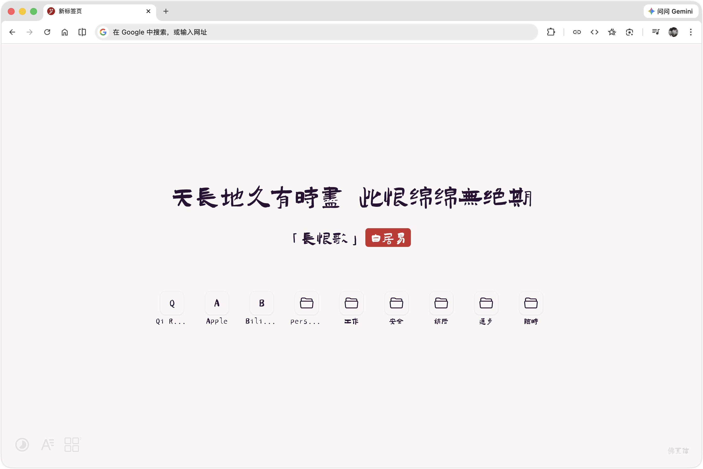
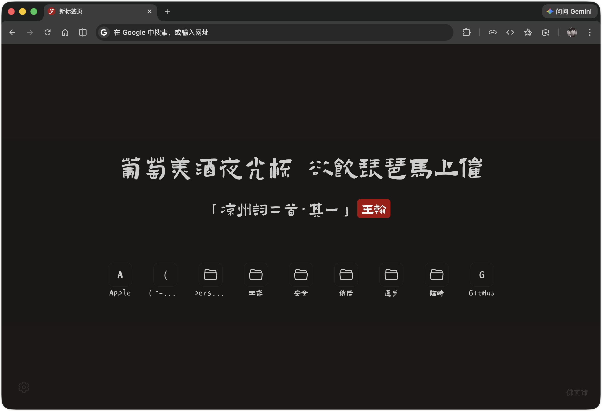

<p align="center">
  
</p>

<h1 align="center">Oneiro</h1>

<p align="center">
  取「梦」字致敬原项目「浮生梦」<br/>
  <em>源自希腊语 oneiros（ὄνειρος），意为"梦"</em>
</p>

<p align="center">
  一个优雅的 Chrome 新标签页扩展<br/>
  在新标签页上展示中国经典诗词，以 Apple 风格展示浏览器书签
</p>

---

## ✨ 功能特性

| 功能 | 说明 |
|------|------|
| 📖 经典诗词 | 新标签页展示中国经典诗词，完全离线数据 |
| 🔖 书签栏 | Apple 风格圆角图标，展示浏览器书签栏内容 |
| 📂 文件夹嵌套 | 毛玻璃弹出面板，支持多层递归展开 |
| 🔄 实时同步 | 浏览器书签增删改即时反映 |
| 🎨 7 种字体 | 多种中国风字体可切换，右下角显示当前字体名 |
| 🌗 主题切换 | 浅色 / 深色 / 跟随系统三种模式 |
| ⚙️ 自定义行数 | 书签展示行数 1-4 行可调 |
| ⚡ 极速加载 | 完全离线运行，针对低功耗设备优化 |

## 📸 预览





## 🛠️ 技术栈

`WXT` · `React` · `TailwindCSS v4` · `DaisyUI`

## 📦 安装

### 方式一：下载 Release 包

前往 [Releases](../../releases) 页面下载对应浏览器的 zip 包：

| 包名 | 适用浏览器 |
|------|-----------|
| `oneiro-chrome-edge.zip` | Chrome / Edge |
| `oneiro-firefox.zip` | Firefox |

#### Chrome / Edge

1. 下载 `oneiro-chrome-edge.zip` 并解压
2. 打开 `chrome://extensions/`（Edge 为 `edge://extensions/`）
3. 开启右上角 **开发者模式**
4. 点击 **加载已解压的扩展程序**，选择解压后的 `chrome-mv3` 文件夹

#### Firefox

1. 下载 `oneiro-firefox.zip` 并解压
2. 打开 `about:debugging#/runtime/this-firefox`
3. 点击 **临时载入附加组件**，选择解压后 `firefox-mv2` 文件夹中的 `manifest.json`

> ⚠️ Firefox 临时扩展在关闭浏览器后会自动卸载，需重新加载。

### 方式二：从源码构建

```bash
# Chrome / Edge
pnpm install
pnpm run build

# Firefox
pnpm run build --browser firefox
```

构建输出目录分别为 `.output/chrome-mv3/` 和 `.output/firefox-mv2/`。

## 📋 路线图

- [x] Apple 风格书签栏
- [x] 多种中文字体切换
- [x] 明暗主题自动适配
- [ ] 导入更多自定义来源的诗词
- [ ] 独立网页版
- [ ] 自定义背景
- [ ] 搜索框
- [ ] 自定义字体导入

## 📝 更新日志

### v2.0.0

**新增**
- 🔖 Apple 风格书签栏，圆角图标展示浏览器书签
- 📂 文件夹嵌套展开，毛玻璃弹出面板，支持多层递归
- 🔄 实时同步浏览器书签增删改
- ⚙️ 可自定义书签展示行数（1-4 行）
- 💬 悬浮 tooltip 显示书签完整名称与网址
- 🏷️ 右下角显示当前字体名称
- 🎨 全新扩展图标：佛系体「梦」字 + 红色圆形背景

**优化**
- 🔤 文件夹内文字统一使用霞鹜文楷
- 🔠 字体回退链优先使用霞鹜文楷，减少缺字问题

## � 鸣谢

本项目基于 [xxnuo/jizhi-mod](https://github.com/xxnuo/jizhi-mod)（浮生梦 v1.3.3）二次开发。

- 字体来自 [中文网字计划](https://chinese-font.netlify.app/)
- 原始灵感来自 [unicar9/jizhi](https://github.com/unicar9/jizhi)（几枝）

## 📄 License

MIT
